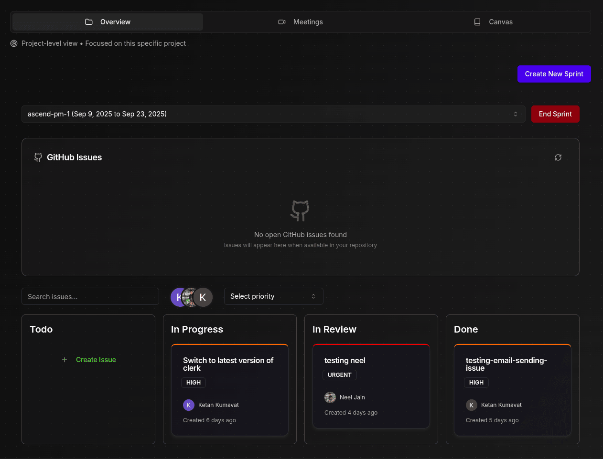
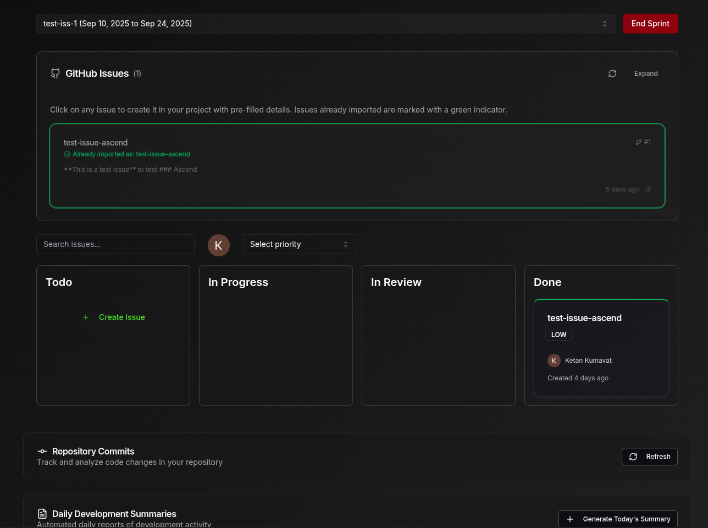

# 🚀 Ascend - Modern Project Management Platform

<div align="center">

**A comprehensive project management platform that combines team collaboration, AI-powered insights, and real-time communication.**

[🌐 Live Demo](https://ascend.ketankumavat.me)

</div>

---

## ✨ What is Ascend?

Ascend is a next-generation project management platform that revolutionizes team collaboration through:

-   **🤖 AI-Powered Intelligence** - Smart insights and automated reporting
-   **🎥 Real-Time Collaboration** - Integrated video meetings with live transcription
-   **📊 GitHub Integration** - Seamless code tracking and analysis

---

## 🎯 Key Features

### 🏗️ **Project Management**

-   **Agile Sprint Planning** - Kanban boards with drag-and-drop functionality
-   **Advanced Issue Tracking** - Priority levels, assignments, and status workflows
-   **GitHub Issues Sync** - Convert GitHub issues to project tasks with one click
-   **Team Collaboration** - Multi-tenant organization support

### 🤖 **AI-Powered Features**

-   **Meeting Transcription** - Real-time speech-to-text with speaker identification
-   **Smart Summaries** - AI-generated meeting and commit summaries
-   **Commit Analysis** - AI-powered commit message insights and code quality reports

### 🎥 **Real-Time Collaboration**

-   **Video Meetings** - High-quality video/audio with LiveKit integration
-   **Live Chat** - Instant team communication
-   **Screen Sharing** - Collaborative presentations and reviews
-   **Meeting Records** - Searchable transcripts and recordings

### 📧 **Smart Notifications**

-   **Daily Summaries** - Automated development reports via email
-   **Issue Assignments** - Instant notifications for new tasks
-   **Meeting Reminders** - Scheduled meeting alerts
-   **Progress Updates** - Real-time project status updates

## 🛠️ Technology Stack

<table>
<tr>
<td>

### Frontend

-   **Next.js 15** - React framework with App Router
-   **React 18** - Modern component architecture
-   **Tailwind CSS** - Utility-first styling
-   **Shadcn/ui** - Beautiful component library
-   **Framer Motion** - Smooth animations

</td>
<td>

### Backend

-   **Next.js API Routes** - Serverless endpoints
-   **Prisma ORM** - Type-safe database queries
-   **PostgreSQL** - Robust relational database
-   **Server Actions** - Direct server functions
-   **Middleware** - Request/response processing

</td>
</tr>
<tr>
<td>

### Integrations

-   **LiveKit** - Real-time video/audio
-   **Google Gemini AI** - Advanced AI processing
-   **GitHub API** - Repository integration
-   **Resend** - Email delivery service
-   **Clerk** - Authentication & user management

</td>
</tr>
</table>

---

## 🚀 Quick Start

### Prerequisites

-   **Node.js 18+** and **npm**
-   **PostgreSQL** database (or use Neon DB)
-   **Clerk** account for authentication

### 1️⃣ Clone & Install

```bash
git clone https://github.com/ketankumavat/ascend.git
cd ascend
npm install
```

### 2️⃣ Environment Setup

Create `.env.local` file:

```env
# Database
DATABASE_URL="postgresql://..."

# Authentication (Clerk)
NEXT_PUBLIC_CLERK_PUBLISHABLE_KEY="pk_..."
CLERK_SECRET_KEY="sk_..."

# AI Services
GEMINI_API_KEY="AI..."

# Communication
LIVEKIT_API_KEY="API..."
LIVEKIT_API_SECRET="secret..."

# Email
RESEND_API_KEY="re_..."

# Optional: GitHub Integration
GITHUB_PERSONAL_ACCESS_TOKEN="ghp_..."
```

### 3️⃣ Database Setup

```bash
npx prisma generate
npx prisma db push
```

### 4️⃣ Launch Development Server

```bash
npm run dev
```

Visit [http://localhost:3000](http://localhost:3000) to start using Ascend! 🎉

---

## 📸 Screenshots

<div align="center">

### 🏠 Dashboard Overview


### 📋 Project Management



### 🎥 Github Integration



</div>

---

## 🎯 Use Cases

<table>
<tr>
<td width="50%">

### 🏢 **For Development Teams**

-   Sprint planning and task management
-   Code review coordination
-   Daily standup meetings with transcription
-   Automated progress reporting

</td>
<td>

### 🚀 **For Startups**

-   Rapid project iteration
-   Investor reporting
-   Team scaling management
-   Cost-effective collaboration

</td>
</tr>

</tr>
</table>

---

## 📋 Table of Contents

1. [How It Works](#-how-it-works)
2. [Getting Started](#-getting-started)
3. [Installation](#-installation)
4. [Usage](#-usage)
5. [Tech Stack](#-tech-stack)
6. [Contributing](#-contributing)

---

## 🧑‍💻 How It Works

1. **Sign Up and Log In**

    - Quickly create an account and access your personalized Ascend dashboard.

2. **Set Up Your Organization**

    - Start managing team projects in a collaborative workspace.

3. **Manage Projects and Tasks**

    - Create projects, organize tasks with Kanban boards, and assign team members to ensure efficient workflows.

4. **Plan and Execute Sprints**

    - Schedule, prioritize, and track sprint progress to meet your team’s goals.

5. **GitHub Integration & Daily Summaries**

    - Link GitHub repositories to your projects for automatic commit tracking.
    - Generate individual commit reports with AI-powered analysis.
    - Receive automated daily development summaries via email at 5 PM.
    - View historical daily summaries and manually trigger new ones.

6. **Track and Report Progress**
    - Access real-time, visually intuitive reports to monitor team performance and milestones.

---

## 🚀 Getting Started

Ready to experience Ascend? Follow these steps to set up and explore the tool.

### Prerequisites

-   **Node.js**: Ensure you have Node.js (v14 or higher) installed. [Download Node.js](https://nodejs.org/)
-   **NPM**: Update npm if necessary:
    ```bash
    npm install -g npm
    ```

---

### Clone the Repository

```bash
git clone https://github.com/ketankumavat/ascend.git
cd ascend
```

---

## 🔧 Installation

1. **Install Dependencies**:

    ```bash
    npm install
    ```

2. **Environment Variables**:

    - Create a `.env.local` file in the root directory.
    - Configure the following variables:
        ```plaintext
        DATABASE_URL=<your_database_url>
        NEXT_PUBLIC_CLERK_PUBLISHABLE_KEY=<clerk_publishable_key>
        CLERK_SECRET_KEY=<clerk_secret_key>
        GITHUB_PERSONAL_ACCESS_TOKEN=<your_github_access_token>
        ```

3. **Run Prisma Migrations**:

    ```bash
    npx prisma migrate dev
    ```

4. **Run the Development Server**:
    ```bash
    npm run dev
    ```
    Open [http://localhost:3000](http://localhost:3000) to access the app.

---

## 💻 Usage

1. **Kanban Boards**: Manage tasks visually with a simple drag-and-drop interface.
2. **Sprint Planning**: Organize, assign, and execute tasks effectively to hit deadlines.
3. **Automated Daily Report**: Connect GitHub repositories to projects and automatically generate daily reports summarizing contributions.
4. **Real-Time Insights**: Use intuitive reporting tools to track team and project performance.

---

## 🛠 Tech Stack

-   **Frontend**: Next.js, React, Tailwind CSS, Shadcn
-   **Backend**: Node.js, Prisma, Neon DB, Express
-   **Authentication**: Clerk
-   **Integrations**: GitHub API for commit tracking and reporting

---

## Contributing

To contribute to this project, follow these steps:

1. Fork this repository.
2. Make your changes and commit them to your forked repository.
3. Create a pull request to merge your changes into the original repository.

---

## ⭐ Star the Project

If you find Ascend helpful, please consider giving it a star! ⭐

---
